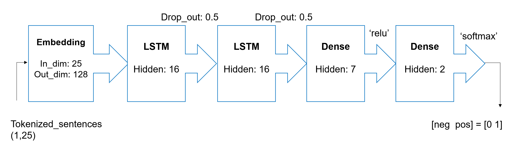
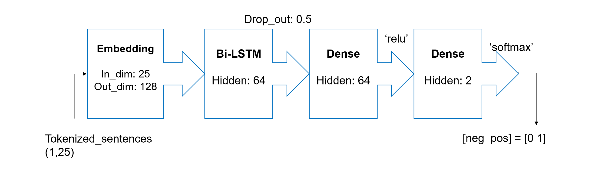
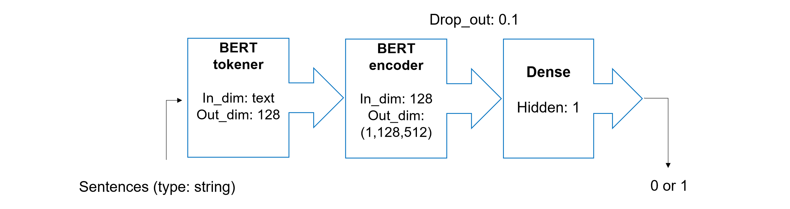

# Sentiments Analysis

## Introduction

This is repository for final project of Machine Learning course. The description of project is here.

## Description

We aim to analyze the sentiments of two databases: the sentiment database from Stanford and the sentiment database from UCI.

To analyze the sentiment databases and make a comparison between the results, we used three kinds of models: LSTM, Bi-LSTM, and BERT.

I. <strong>LSTM and BiLSTM:</strong>

Input of model is a tokenized sentence whose length is 25. It means if length of sentences is less than 25, it would be zero-padded else it would be truncated into 25. In this experiment, I tokenized each word as each token, so tokenized sentences is a tensor having 128 IDs representing for each word in sentence.

Compared to LSTM, I only use one layer for Bi-LSTM for avoiding overfit. 

II. <strong>BERT:</strong>

The architecture has a tokenizer layer and an embedding layer which are provided by BERT and a neural network with one hidden node. The input of architecture has type of string which is tokenized by BERT tokenizer into dimension 128. The process of tokenizing is doing by using a id-vocabulary dictionary of BERT which has over 30500 vocabularies.

Then, the tensor will go through BERT encoder. Since BERT version used in the experiment is L_4_H_512_A_8 (4 layers, 512 hidden nodes, 8 attention headers) as known as BERT Small, output is embedding matrix having dimension (1,128,512). It means, each token from BERT tokener is calculated into each vector 512D by BERT embedder. If input has more than a sentence, dimension of output will be (n,128,512) (n is the amount of sentences). In the end, this embedding matrix will be manipulated by a neural network layer which has only one hidden node. Result of architecture is 0 expressing negative attitude of speaker, whereas it would be positive attitude of speaker.

## How to Run

Pre-process data: run /Preprocess/preprocess.py to create the 'preprocessed_data' for LSTM and Bi-LSTM. Then, we move 'preprocessed_data' to '/GoogleColab/RNN' folder.

Because those files were executed on Google Colab, we should upload those files to the 'My Drive' folder of Google Drive:
* Upload those files in '/GoogleColab/RNN' to the 'My Drive' folder of Google Drive for using LSTM and Bi-LSTM to analyze sentiments on the Stanford and UCI sentiment databases.
* Upload those files in '/GoogleColab/bert_classify' to the 'My Drive' folder of Google Drive for using BERT to analyze sentiments on the Stanford and UCI sentiment databases.

## Result of training

<table>
  <tr>
	<td > </td>
    <td colspan="2">DATASET OF uci</td>
    <td colspan="2">DATASET OF ailImdb</td>
  </tr>
  <tr>
	<td > </td>
	<td >Train_acc</td>
	<td >Test_acc</td>
	<td >Train_acc</td>
	<td >Test_acc</td>
  </tr>
  <tr>
	<td >LSTM</td>
	<td >0.974</td>
	<td >0.80</td>
	<td >0.9754</td>
	<td >0.769</td>
  </tr> 
  <tr>
	<td >Bi-LSTM</td>
	<td >0.979</td>
	<td >0.79</td>
	<td >0.968</td>
	<td >0.772</td>
  </tr>
  <tr>
	<td >BERT</td>
	<td >0.9921</td>
	<td >0.8933</td>
	<td >0.997</td>
	<td >0.8526</td>
  </tr>
</table>
